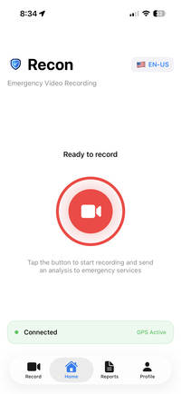
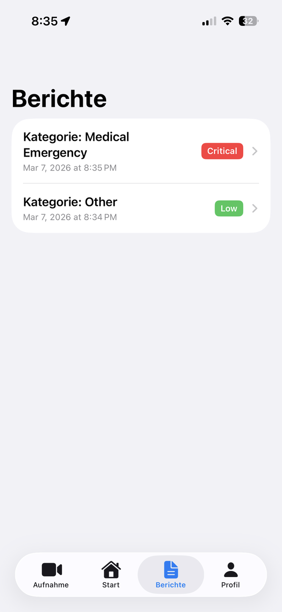
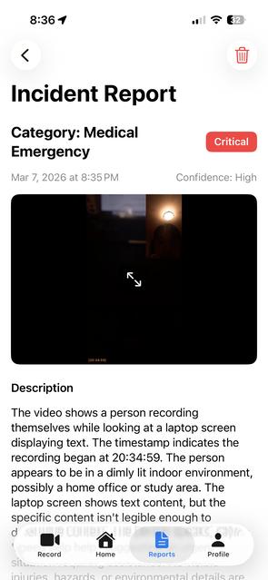
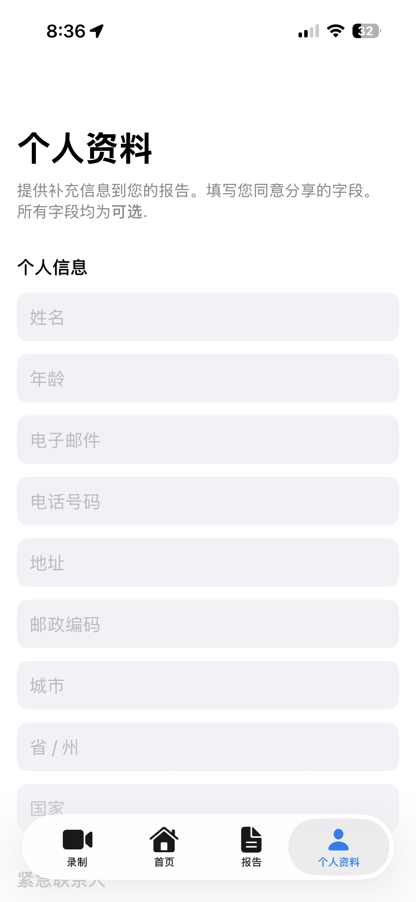

  
  
  # Recon

  
  

  

  For installation -- **<a href="./INSTALLATION GUIDE.md">INSTALLATION GUIDE.md</a>**

  <!-- Devpost -- **[https://devpost.com/software/recon-ambnp1](https://devpost.com/software/recon-ambnp1)** -->

  Video Demo -- **[https://www.youtube.com/watch?v=PKwWFbcJCJs](https://www.youtube.com/watch?v=PKwWFbcJCJs)**

## Inspiration
Emergencies happen. They're unpredictable, and they happen fast. We can't control how they happen or who they happen to. However, we can control how quickly help arrives. 

Ideally, an emergency 911 call is made instinctively, lightning-fast. Accurate and detailed information should be clearly presented to first responders ASAP. **This shouldn't be a hard process.** And yet, in the moment, things can go wrong. You might go into shock and forget to document events. You might not be able to think and communicate clearly. There might be a language barrier. In dire situations, you might not even be able to speak. Communication is key in emergencies, and examples like these ultimately delay first responders' ability to assist you. This is why I built Recon.

Recon was initially inspired after my family got into a car accident. This was our first ever accident, and we faced so much trouble with the police and local residents simply because there was a language barrier, as we were out of province. Furthermore, in the heat of the moment, we forgot to take well-documented pictures of the accident, which is crucial for making claims. Asking for help should never be a stressful and convoluted process. It should be as easy as clicking a button. **Recon fixes this.**

## What it does

Recon records the scene. It can act as a standalone app or as a video recorder that supplements phone calls. When recording, it live transcribes the audio in a language of the user's choice. Nova then analyzes this recording and generates a structured incident report that provides key details of the scene with live video playback, which first responders can review. 

In an emergency, a video and an analyzed report can **significantly** increase the quality and speed of communication, potentially **expediting aid**.

- **Records in FaceTime format:** Video is constructed to have the front-camera aligned in the top-right corner overlaying the back-camera, with a 24h clock timestamped

- **Live Audio Transcription:** Helps Nova analyze the scene and key highlights are included in the report

- **Amazon Nova 2 Lite Analysis:** Nova analyzes the transcript and video and decides what information will be useful for first responders to help them assist faster and more accurately, and compiles everything into a structured, clean report

- **Send Report to Emergency Responders:** Each report can be sent to first responders and contains the following information generated by Nova:  
  - Brief summary of events
  - Number and description of people involved
  - Severity of the event, with Nova confidence level
  - Visible hazards and key scenes marked with a timestamp
  - Landmarks, street names, location details and precise GPS coordinates
  - Transcript highlights and language details
  - Recommended next step actions

- **12+ Languages Supported:** Recon text and audio transcription can be translated into 12+ languages. Nova 2 Lite can understand and process different audio and transcription languages and translate the content into English for the structured report.

- **Profile Section:** Users can optionally fill in personal and emergency contact information to supplement Nova's report

## How I built it

- **Video Construction:** Record using both the front and back cameras of the iPhone, and each second, buffer both frames into Core Images (CI, Apple's image processing framework). Using Apple's Video Compositor, scale and translate the front CI and compose it over the back CI and burn in the timestamp. For each frame, Apple's Video Writer converts the CI and raw audio into a processable buffer and then Asset Writer combines them both into a (~30fps) .mov file frame by frame.

- **AWS Video Processing:** AWS Lambda server provides a presigned URL to upload the recorded video to S3. Lambda downloads and base64-encodes the video since Nova recognizes base64 data. Nova 2 Lite is called via the OpenAI SDK

- **Amazon Nova 2 Lite Multimodal Analysis:** Lambda analyzes the video with detailed prompting along with the transcript, GPS coordinates, recording duration and language context and generates the report in English

- **12+ Language Support:** App UI is translated via a locally stored dictionary. Audio transcription will detect language based on the user-selected language. The transcribed audio and language selection is sent to Nova, which can understand and translate into English

- **App Logic and UI:** Built with Swift, SwiftUI, and Xcode for iOS testing and compatibility

## Challenges I ran into

- **Video Construction:** Apple has no built-in method to combine the front and back cameras. You have to construct it frame by frame as a Core Image. It's also important how you layer the app UI, since the camera UI defaults to a size of 0, which makes it difficult to overlay it on a blank canvas. I bypassed this by making the camera view the base canvas

- **Accessing Amazon Nova:** AWS automatically gives a 0 token quota for all Nova foundational models on Bedrock, and requesting more takes time and is often rejected. Ended up using OpenAI SDK. Furthermore, documentation for Nova is limited and wasn't user-friendly in my opinion, and I still can't figure out how to call Nova 2 Sonic correctly

- **Auto-Detect Language:** If Nova 2 Lite is provided a video in a different language, but the transcriber was trying to transcribe English, Nova has a very difficult time understanding the audio, even when specifically prompted to ignore the transcription. It does a fantastic job if the transcription and video audio languages align. So the transcriber needs to be able to process different languages.

- **Transcription Services:** Apple transcription can only process a pre-specified language and defaults to the device language. My workaround was to add multilingual support to the app entirely and let users set the language. I tried implementing some auto-detection solutions, but they all failed. I was denied usage by AWS to use Amazon Transcribe, and ffmpeg with GCP Transcribe + Translate was too convoluted a pipeline and didn't end up working

- **Recording Simultaneously on Call:** It's difficult to record a video when on call because Apple audio and video services are coupled, so if the audio is being used, the camera will freeze. Furthermore, iOS invokes `AudioSession.setActive(true)` when on a call, which means you cannot negotiate control over the audio, and this was discovered after testing several times since Apple's documentation doesn't mention this. To work around this, if Recon detects that the device is on a call already, then don't configure audio for the video, so no negotiation for the audio service is required, which prevents the video from freezing. Also, when already recording, and a phone call occurs, instead of letting the interruption handler stop and rebuild the recording and reconfigure inputs and outputs (which would cause a freeze), just disconnect the audio for the remainder of the recording.

## What's next for Recon

- Auto-detect language in transcription and video for more accessibility, and increase the language support

- Add the option to allow Nova to analyze a screen recording

- Request support from Apple to allow for real-time call and recording (FaceTime) with 911 first responders. Allow users to activate Recon directly from the call menu to increase accessibility and speed. Allow Nova to analyze and communicate in real-time 

- Request support from local police departments and city counsellors to create a service that allows Recon to communicate with them securely and consistently and make this a more recognized and accessible platform that can **make a real difference**

- Android support

